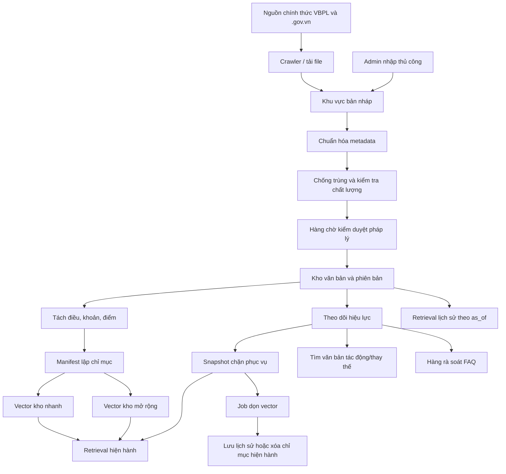

# Kế hoạch phân tích và thiết kế hệ thống quản lý văn bản pháp luật

**Trạng thái:** Đề xuất thiết kế, chưa cho phép migration hoặc thao tác trên kho dữ liệu thật  
**Phạm vi:** Kho văn bản pháp luật, hiệu lực, phiên bản, quan hệ thay thế, chỉ mục, vector, lịch sử, FAQ chịu ảnh hưởng và audit  
**Quy mô mục tiêu:** Từ 20.000 đến 100.000 văn bản  
**Vai trò:** Người dân, cán bộ, biên tập viên pháp lý, kiểm duyệt viên pháp lý, Admin kỹ thuật và Super Admin

## 1. Mục tiêu

Xây dựng một trung tâm quản trị toàn bộ vòng đời văn bản:

```text
Nguồn chính thức
→ tiếp nhận
→ chống trùng
→ kiểm tra chất lượng
→ phê duyệt
→ lập chỉ mục
→ phục vụ
→ theo dõi hiệu lực
→ tìm văn bản tác động/thay thế
→ ngừng phục vụ
→ dọn vector/lưu lịch sử
→ phục hồi khi được phê duyệt
```

Kết quả bắt buộc:

- Văn bản hết hiệu lực không được dùng làm căn cứ hiện hành.
- Văn bản chưa duyệt không được đưa vào câu trả lời.
- Không dùng LLM hoặc độ giống vector làm bằng chứng xác nhận quan hệ pháp lý.
- Nội dung đã duyệt không bị ghi đè; mọi sửa đổi tạo phiên bản mới.
- SQL/kho file là nguồn dữ liệu gốc; vector là chỉ mục có thể tạo lại.
- Mọi thao tác thêm, sửa, chặn, dọn, xóa và phục hồi có người thực hiện, lý do, thời gian và audit.
- Người dân và cán bộ chỉ nhìn thấy dữ liệu phù hợp vai trò.
- Có thể tra cứu văn bản tại một ngày trong quá khứ bằng `as_of`.

## 2. Hiện trạng và khoảng trống

### Nền tảng đã có

- Danh sách kho văn bản và phân tầng kho nhanh/kho mở rộng.
- Tìm kiếm vector, từ khóa, exact lookup và batch retrieval.
- Snapshot hiệu lực và lớp lọc trước khi kết quả đi vào mô hình.
- Chuẩn hóa trạng thái hiệu lực toàn phần/một phần.
- Hàng sự kiện hiệu lực và quyết định Admin.
- Projection ứng viên văn bản tác động từ bằng chứng chính thức.
- Manifest dọn vector theo exact chunk ID, kiểm đếm hai collection và API Admin có audit/token.
- Giao diện hiệu lực cơ bản trong trang Nạp dữ liệu luật.

### Khoảng trống cần triển khai

- Dashboard vận hành cho toàn bộ kho.
- Thêm văn bản bằng bản nháp và quy trình duyệt.
- Sửa metadata/nội dung bằng phiên bản.
- Ngừng phục vụ, lưu trữ, phục hồi và xóa có kiểm soát.
- Quan hệ văn bản hai chiều và hàng ứng viên đầy đủ.
- Hàng công việc nền có trạng thái/retry.
- Kho lịch sử riêng hoặc chiến lược tái tạo vector lịch sử.
- Theo dõi FAQ, câu trả lời mẫu, thủ tục và biểu mẫu chịu ảnh hưởng.
- Thao tác hàng loạt, báo cáo, kiểm tra phụ thuộc và cơ chế hai người duyệt.

## 3. Nguyên tắc thiết kế không được vi phạm

1. **Nguồn chính thức là căn cứ:** giữ URL, metadata và bằng chứng nguyên gốc.
2. **Chặn trước, dọn sau:** không chờ xóa vector mới chặn phục vụ.
3. **Không ghi đè:** nội dung đã duyệt chỉ được thay bằng một phiên bản mới đã duyệt.
4. **Không tự suy đoán:** metadata/vector/LLM chỉ xếp hạng ứng viên.
5. **Fail closed:** bằng chứng thiếu, xung đột hoặc phạm vi một phần chưa rõ phải bị chặn an toàn theo chế độ đã cấu hình.
6. **Tách quyền:** người tạo/sửa không tự duyệt thay đổi quan trọng của mình.
7. **Audit trước mutation nguy hiểm:** audit hỏng thì thao tác không chạy.
8. **Không hard delete mặc định:** ngừng phục vụ và lưu trữ là lựa chọn chuẩn.
9. **Local-first:** parser/model nâng cao phải là tùy chọn, thiếu dependency vẫn có fallback rõ ràng.
10. **Không migration/corpus mutation khi chưa duyệt:** mọi thay đổi schema và thao tác dữ liệu thật cần một lát cắt phê duyệt riêng.

## 4. Kiến trúc tổng thể



### Các lớp hệ thống

- **Nguồn:** adapter nguồn chính thức, crawler, tải file và kiểm tra TLS/allowlist.
- **Staging:** bản nháp, file tạm, metadata tạm, kết quả parser và chống trùng.
- **Review:** hàng chờ, quyết định, reason, người duyệt và nguyên tắc bốn mắt.
- **Corpus:** văn bản, phiên bản, điều khoản và file gốc.
- **Operational:** sự kiện hiệu lực, quan hệ, job, manifest, tác động FAQ và audit.
- **Retrieval:** SQL lexical/exact, vector nhanh/mở rộng/lịch sử, snapshot hiệu lực.
- **Presentation:** giao diện Admin, cán bộ và trải nghiệm công khai.

## 5. Vai trò và quyền

| Vai trò | Xem | Tạo/sửa | Duyệt pháp lý | Chỉ mục/vector | Xóa/phục hồi |
|---|---|---|---|---|---|
| Người dân | Nguồn công khai | Không | Không | Không | Không |
| Cán bộ | Căn cứ chi tiết, lịch sử | Đề xuất | Không | Không | Không |
| Biên tập viên pháp lý | Toàn bộ hồ sơ nghiệp vụ | Bản nháp/phiên bản | Không tự duyệt | Không | Không |
| Kiểm duyệt viên pháp lý | Toàn bộ bằng chứng | Yêu cầu sửa | Có | Không | Xác nhận ngừng phục vụ |
| Admin kỹ thuật | Vận hành và audit kỹ thuật | Cấu hình kỹ thuật | Không tự kết luận pháp lý | Có | Dọn vector, lập lại chỉ mục |
| Super Admin | Toàn bộ | Có | Có theo chính sách | Có | Phê duyệt hard delete/phục hồi |

Các API phải kiểm tra quyền phía server, gồm kiểm thử sửa ID trực tiếp và truy cập chéo vai trò.

## 6. Các phân hệ chức năng

### 6.1. Dashboard

Hiển thị và cho phép drill-down:

- Tổng số văn bản.
- Đang phục vụ; kho nhanh; kho mở rộng; kho lịch sử.
- Chưa hiệu lực; sắp hết hiệu lực; hết toàn bộ/một phần.
- Bị thay thế; bãi bỏ; đình chỉ; chưa xác minh.
- Bản nháp; chờ duyệt; bị từ chối.
- Thiếu metadata/nội dung; lỗi OCR; nguồn hỏng.
- Chưa lập chỉ mục; lập chỉ mục một phần/thất bại.
- Có khả năng trùng; có ứng viên thay thế.
- FAQ/câu trả lời/thủ tục cần rà soát.
- Job đang chạy, partial, failed và retrying.

### 6.2. Danh sách và tìm kiếm

Hỗ trợ lọc theo số/ký hiệu, tên, loại, cơ quan, người ký, lĩnh vực, phạm vi, ngày ban hành/hiệu lực/hết hiệu lực, trạng thái hiệu lực, trạng thái duyệt, trạng thái chỉ mục, tier, nguồn, quan hệ thay thế, lỗi dữ liệu và tác động FAQ.

Yêu cầu kỹ thuật:

- Phân trang và sắp xếp phía server.
- Lưu bộ lọc và xuất CSV/XLSX.
- Chọn nhiều bản ghi, nhưng thao tác nguy hiểm luôn có impact preview.
- Không tải nội dung/chunk ở trang danh sách.

### 6.3. Trang chi tiết

Các tab: Thông tin chung; Nội dung; Hiệu lực và thay thế; Chỉ mục và vector; FAQ bị ảnh hưởng; Phiên bản; Lịch sử và audit.

### 6.4. Thêm văn bản

Luồng:

```text
draft → validating → duplicate_review → submitted → approved
→ indexing → indexed_pending_activation → active
```

Kiểm tra bắt buộc: định dạng số hiệu, cơ quan/ngày, nguồn chính thức, trùng số hiệu, URL, hash file/nội dung, đủ trang, OCR/Unicode, cấu trúc điều khoản và metadata tối thiểu.

Văn bản thêm thủ công chưa xác minh phải ở staging, không được vào retrieval.

### 6.5. Sửa văn bản

- Sửa metadata vẫn tạo change record và audit.
- Sửa nội dung luôn tạo `DocumentVersion` mới.
- Hiển thị diff điều/khoản và phụ thuộc bị ảnh hưởng.
- Dùng optimistic locking/ETag để tránh ghi đè đồng thời.
- Phiên bản mới chỉ active khi review, SQL và toàn bộ vector thành công.
- Thất bại giữ nguyên phiên bản đang phục vụ.

### 6.6. Ngừng phục vụ, lưu trữ và xóa

- `deactivate`: chặn logic, giữ dữ liệu và có thể phục hồi.
- `archive`: chỉ phục vụ truy vấn lịch sử.
- `vector_cleanup`: xóa exact ID sau khi block.
- `permanent_delete`: chỉ cho bản nhập nhầm/trùng/test, có backup, dependency check, hai người duyệt và thời gian chờ.

### 6.7. Hiệu lực

Trạng thái chuẩn: `not_yet_effective`, `active`, `expired`, `expired_partial`, `suspended`, `suspended_partial`, `amended`, `replaced`, `repealed`, `unknown`.

Mọi đường retrieval phải dùng chung snapshot/bộ lọc hiệu lực. Hết hiệu lực một phần rõ phạm vi chỉ chặn đúng điều khoản; chưa rõ phạm vi phải chặn toàn văn cho ngữ cảnh hiện hành.

### 6.8. Tìm văn bản tác động/thay thế

1. Quan hệ ghi rõ trên nguồn chính thức.
2. Tra exact số hiệu văn bản tác động.
3. Xếp hạng metadata: lĩnh vực, loại, thẩm quyền, cơ quan, thời gian và viện dẫn.
4. Xếp hạng nội dung/vector, không dùng làm bằng chứng pháp lý.

Ứng viên luôn ở `pending_admin_review` cho đến khi có quyết định.

### 6.9. Chỉ mục và vector

- Manifest chính xác từ chunk ID.
- Tách collection nhanh, mở rộng và lịch sử.
- Kiểm đếm trước/sau.
- Idempotency và retry.
- Không kích hoạt khi chỉ một collection thành công.
- Có thể tái tạo vector từ nội dung lưu trữ.

### 6.10. Tác động FAQ

Khi hiệu lực hoặc phiên bản thay đổi, lập danh sách FAQ, câu trả lời mẫu, thủ tục và biểu mẫu đang viện dẫn căn cứ cũ. Hệ thống chỉ tạo hàng chờ; không tự sửa nội dung pháp lý.

## 7. Mô hình dữ liệu đề xuất

| Thực thể | Mục đích chính |
|---|---|
| `LegalDocument` | Định danh ổn định của văn bản |
| `DocumentVersion` | Từng phiên bản nội dung và metadata |
| `DocumentDraft` | Dữ liệu staging chưa duyệt |
| `LegalProvision` | Điều, khoản, điểm và structural path |
| `OfficialSourceObservation` | Bằng chứng nguồn theo thời điểm |
| `ValidityEvent` | Sự kiện thay đổi hiệu lực |
| `ValidityDecision` | Quyết định của người kiểm duyệt |
| `DocumentRelationship` | Sửa đổi, thay thế, bãi bỏ, liên quan |
| `ReplacementCandidate` | Ứng viên và lý do xếp hạng |
| `DocumentApproval` | Quy trình submit/approve/reject |
| `IndexManifest` | Chunk/vector ID dự kiến theo phiên bản |
| `IndexJob` | Job lập/lập lại chỉ mục |
| `VectorCleanupJob` | Job dọn/chuyển vector |
| `FaqImpact` | Nội dung nghiệp vụ chịu ảnh hưởng |
| `DeletionRequest` | Yêu cầu xóa và phê duyệt hai bước |
| `RestorePoint` | Dữ liệu cần để phục hồi |
| `AuditLog` | Nhật ký không thể sửa/xóa qua UI |

### Quan hệ chính

- Một `LegalDocument` có nhiều `DocumentVersion`.
- Một version có nhiều `LegalProvision` và một hoặc nhiều `IndexManifest`.
- Document có nhiều observation/event/decision/relationship.
- Job tham chiếu exact document version và manifest fingerprint.
- FAQ impact tham chiếu cả document, provision và phiên bản căn cứ.

## 8. State machine

### Văn bản

```text
draft → submitted → approved → indexing → active
active → blocked → archived
blocked | archived → restore_pending → indexing → active
draft | submitted → rejected
```

### Job

```text
queued → running → completed | partial | failed
partial | failed → retrying → running
```

### Dọn vector

```text
blocking_applied
→ vector_cleanup_running
→ vector_cleanup_completed | vector_cleanup_partial | vector_cleanup_failed
→ archived | restored
```

## 9. Hợp đồng API đề xuất

### Đọc kho

```text
GET /admin/legal-documents
GET /admin/legal-documents/{id}
GET /admin/legal-documents/{id}/impact-preview
GET /admin/legal-documents/{id}/versions
GET /admin/legal-documents/{id}/audit
```

### Bản nháp và phiên bản

```text
POST /admin/legal-documents/drafts
PUT  /admin/legal-documents/drafts/{id}
POST /admin/legal-documents/drafts/{id}/validate
POST /admin/legal-documents/drafts/{id}/submit
POST /admin/legal-documents/{id}/approve
POST /admin/legal-documents/{id}/reject
POST /admin/legal-documents/{id}/versions
```

### Hiệu lực và quan hệ

```text
POST /admin/legal-documents/{id}/validity-check
GET  /admin/legal-documents/{id}/replacement-candidates
POST /admin/legal-relationships/{id}/confirm
POST /admin/legal-relationships/{id}/reject
POST /admin/legal-documents/{id}/deactivate
```

### Chỉ mục và vòng đời

```text
POST /admin/legal-documents/{id}/reindex
GET  /admin/legal-documents/{id}/vector-cleanup/preview
POST /admin/legal-documents/{id}/vector-cleanup
POST /admin/legal-documents/{id}/archive
POST /admin/legal-documents/{id}/restore
POST /admin/legal-documents/{id}/deletion-request
POST /admin/legal-documents/{id}/permanent-delete
GET  /admin/legal-jobs/{job_id}
```

Mọi mutation phải có authentication, authorization, `reason`, idempotency key, version/ETag, audit và lỗi chuẩn hóa không lộ bí mật.

## 10. Thiết kế giao diện

Menu quản trị:

1. Tổng quan.
2. Toàn bộ văn bản.
3. Bản nháp.
4. Chờ phê duyệt.
5. Hiệu lực và thay thế.
6. Chỉ mục và vector.
7. Kho lịch sử.
8. FAQ bị ảnh hưởng.
9. Công việc đang chạy.
10. Lỗi dữ liệu.
11. Nhật ký quản trị.

Trên danh sách có nút **Thêm văn bản** và menu theo dòng: Xem; Tạo phiên bản sửa; Kiểm tra hiệu lực; Ngừng phục vụ; Lập lại chỉ mục; Dọn vector; Lưu trữ; Yêu cầu xóa.

Mọi thao tác nguy hiểm phải mở hộp thoại impact preview, hiển thị số document/provision/chunk/vector/FAQ bị ảnh hưởng, khả năng phục hồi và yêu cầu nhập lý do.

## 11. Job nền và tính nhất quán

Các job dài: crawler, tải file, OCR, parse, dedup, validity sync, replacement discovery, embedding, cleanup, FAQ impact và restore.

Vì SQL và Chroma không chung transaction, dùng state machine + manifest + idempotency thay cho giả định transaction xuyên hệ thống. Cần bảo đảm:

- SQL/staging được ghi trước.
- Vector chỉ gắn với phiên bản cụ thể.
- Chỉ active sau khi mọi collection cần thiết thành công.
- Cleanup chỉ chạy sau blocking.
- Job partial/failed có thể retry mà không nhân bản dữ liệu.
- Cache bị vô hiệu hóa sau activation/deactivation/cleanup.

## 12. Bảo mật, audit và phục hồi

- Kiểm tra role server-side; không chỉ ẩn nút.
- Token nội bộ riêng cho thao tác vector.
- Hai người phê duyệt hard delete và thay đổi pháp lý nhạy cảm.
- Không log token, file thô, nội dung hồ sơ hoặc raw exception.
- Backup trước migration/hard delete.
- Audit append-only theo chính sách hệ thống.
- Retention cho bản nháp/file tạm; không áp dụng retention ngắn cho căn cứ đã phục vụ.
- Diễn tập restore SQL, file, manifest và vector.

## 13. Hiệu năng và quan sát

- Danh sách phân trang server-side, chỉ trả metadata cần thiết.
- Snapshot hiệu lực trong bộ nhớ, không gọi DB/network cho từng result.
- Job dài không khóa request giao diện.
- Theo dõi p50/p95 retrieval, validity overlay, Admin list/detail và job duration.
- Metrics: coverage hiệu lực, source health, SQL/vector drift, job retry, vector còn sót, document chưa xác minh và FAQ tồn đọng.
- Mục tiêu ban đầu: danh sách/filter p95 dưới 1 giây trên 100.000 metadata record; impact preview và job enqueue p95 dưới 2 giây, không tính xử lý nền.

## 14. Kế hoạch triển khai

### Giai đoạn 0 — Baseline và đặc tả

- Chụp schema/collection hiện có, corpus checksum và latency baseline.
- Lập ma trận quyền và dependency map.
- Chốt spec, data model, API contract, backup/rollback.
- Gate: xin phê duyệt migration trước khi chuyển Giai đoạn 2.

### Giai đoạn 1 — Read-only management console

- Dashboard, bộ lọc, phân trang, trang chi tiết, timeline, vector status và audit projection.
- Không mutation corpus.
- Kiểm thử role, privacy, hiệu năng và browser journey.

### Giai đoạn 2 — Bản nháp, thêm và phiên bản sửa

- Schema staging/version/approval.
- Form thêm/sửa, validation, dedup, diff và review.
- Activation có manifest; failure giữ bản active cũ.

### Giai đoạn 3 — Hiệu lực và thay thế

- Hoàn thiện partial scope, relationship candidate, confirm/reject và nguồn bằng chứng.
- Bảo vệ mọi đường retrieval và historical `as_of`.

### Giai đoạn 4 — Vector và kho lịch sử

- Background cleanup, job status, retry, archive, historical collection hoặc rebuild-on-demand.
- Restore có duyệt và kiểm đếm.

### Giai đoạn 5 — FAQ impact và thao tác hàng loạt

- Dependency scan, hàng chờ rà soát, báo cáo và bulk preview.

### Giai đoạn 6 — Xóa có kiểm soát

- Deletion request, two-person approval, backup, cooling period và hard-delete executor.

### Giai đoạn 7 — Hardening và phát hành

- Load/security/recovery tests.
- Shadow mode, canary Admin, backup/rollback drill.
- Browser test trên câu hỏi tự nhiên và các đường quản trị.

## 15. Chiến lược kiểm thử

- Unit: normalization, dedup, state transition, permission, manifest và impact rules.
- Contract: request/response, reason, idempotency, ETag và error code.
- Integration: SQL + vector fake/sandbox, không xóa dữ liệu thật.
- Retrieval: vector, lexical, exact, batch, current và historical.
- Authorization: role matrix, ID tampering, cross-user access.
- Browser: thêm bản nháp, duyệt, sửa phiên bản, deactivate, cleanup preview, job status, restore và delete request.
- Failure injection: source down, snapshot hỏng, SQL lỗi, một collection lỗi, process restart giữa job.
- Data integrity: corpus checksum, SQL/vector counts, source URL/metadata preservation.

## 16. Điều kiện nghiệm thu

- Văn bản hết hiệu lực không xuất hiện trong câu trả lời hiện hành dù vector còn.
- Partial effectivity chỉ chặn đúng phạm vi đã xác minh; chưa rõ thì fail closed.
- Văn bản chưa duyệt không được phục vụ.
- Không tạo quan hệ thay thế chỉ từ similarity.
- Không nhập bản trùng chính xác.
- Sửa nội dung không ghi đè phiên bản cũ.
- Lập chỉ mục lỗi không kích hoạt phiên bản mới.
- Cleanup kiểm tra đủ mọi collection và retry idempotent.
- Cleanup lỗi không làm văn bản xuất hiện lại.
- Historical `as_of` và restore hoạt động theo phê duyệt.
- Không hard delete khi còn phụ thuộc chưa xử lý.
- Mọi quyết định có nguồn, actor, reviewer, reason và timestamp.
- UI người dân không lộ audit/job/token; cán bộ nhận giải thích chi tiết hơn nhưng vẫn grounded.

## 17. Gate cần người dùng phê duyệt

Trước khi thực hiện Giai đoạn 2 trở đi, cần phê duyệt riêng:

1. Migration cho draft/version/relationship/job/FAQ impact/delete request.
2. Backup và rollback cho các bảng mới.
3. Chính sách hard delete và thời gian chờ.
4. Mô hình kho lịch sử: collection riêng hay rebuild-on-demand.
5. Cơ chế hai người duyệt và ánh xạ tài khoản thực tế.
6. Có cho phép background worker mới hay tái sử dụng tiến trình hiện hành.

Không được tự quyết các gate này trong quá trình coding.

## 18. Tài liệu bàn giao bắt buộc

- Spec và acceptance criteria.
- Research/ADR cho versioning, outbox/state machine, historical index và hard delete.
- Data model và migration up/down.
- OpenAPI/contracts.
- Quickstart Admin.
- Runbook backup/restore, source drift, vector partial cleanup và incident response.
- Test report, benchmark, corpus checksum và release decision.

