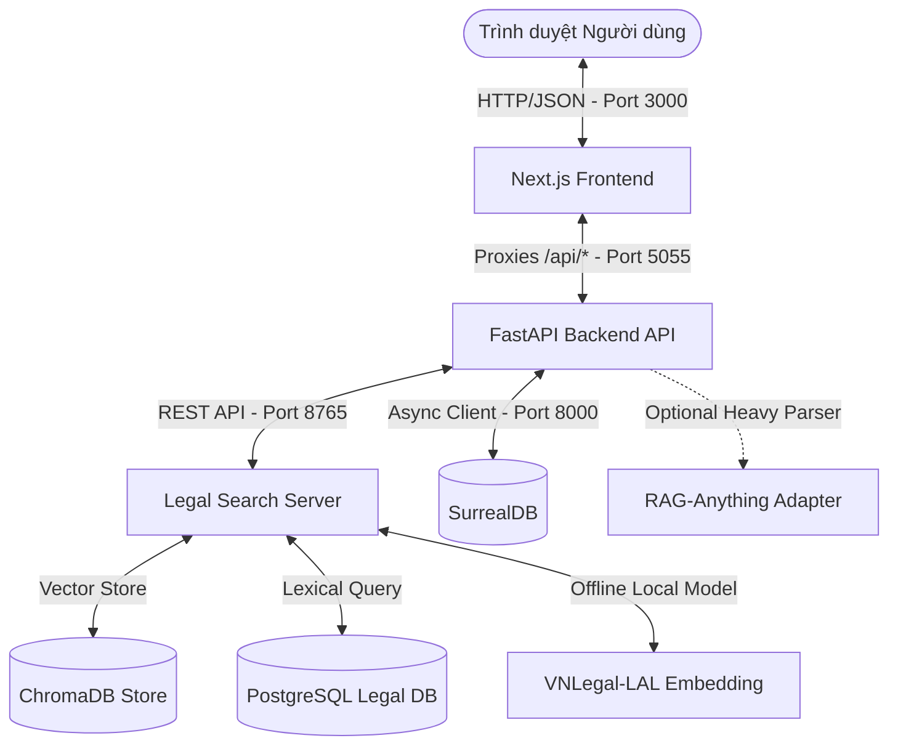

# Tổng Quan Hệ Thống & Công Nghệ Trợ Lý Pháp Luật Hải Phòng

Tài liệu này cung cấp cái nhìn chi tiết về kiến trúc, ngăn công nghệ (technology stack) và tất cả các chức năng hiện có của hệ thống Trợ lý Pháp luật cấp Phường/Xã tại Hải Phòng.

---

## 1. Kiến Trúc Tổng Quan (System Architecture)

Hệ thống được thiết kế theo mô hình **kiến trúc 3 lớp (Three-Tier Architecture)** kết hợp với dịch vụ tìm kiếm lai chuyên biệt (Hybrid Search Server) phục vụ việc tra cứu và hỏi đáp văn bản quy phạm pháp luật:

### Chi tiết các cổng kết nối (Port Mapping):
*   **Port 3000:** Next.js Frontend (giao diện tương tác chính).
*   **Port 5055:** FastAPI Backend API (xử lý logic nghiệp vụ, quản lý phiên chat, ghi chép, đồng bộ dữ liệu).
*   **Port 8765:** Legal Search Server (dịch vụ nhúng vector và tìm kiếm hỗn hợp).
*   **Port 8000:** SurrealDB (cơ sở dữ liệu đồ thị/tài liệu lưu trữ notebooks, notes, chat_sessions, audit logs, và thông tin văn bản gốc).
*   **Port 5432 (Local/Remote):** PostgreSQL (nguồn lưu trữ cơ sở dữ liệu văn bản pháp luật gốc trung ương và Hải Phòng).

---

## 2. Ngăn Công Nghệ (Technology Stack)

### Lớp Giao Diện (Frontend)
*   **Framework:** Next.js 15 (App Router) kết hợp React 19 và TypeScript.
*   **State Management:** Zustand (quản lý state ứng dụng nhẹ nhàng) + TanStack Query (caching dữ liệu từ server).
*   **Giao diện & Styling:** Tailwind CSS + Thư viện components Radix/shadcn UI.
*   **Ngôn ngữ hỗ trợ:** Đã cấu hình và dịch thuật chuẩn chỉ đa ngôn ngữ (Tiếng Việt `vi-VN` làm mặc định, hỗ trợ chuyển đổi linh hoạt).

### Lớp Nghiệp Vụ Backend (API Server)
*   **Framework:** FastAPI 0.104+ (Python 3.11+, lập trình không đồng bộ Async-first).
*   **Validation:** Pydantic v2 (xác thực và chuẩn hóa dữ liệu yêu cầu/phản hồi).
*   **Logging:** Loguru (ghi log có cấu trúc chi tiết).
*   **LLM & RAG Orchestration:** LangGraph (quản lý luồng tác vụ AI, luồng chat, tìm kiếm AskWorkflow) kết hợp với thư viện Esperanto (hỗ trợ tích hợp 8+ nhà cung cấp AI như OpenAI, Gemini, Ollama...).

### Lớp Dữ Liệu & Tìm Kiếm Vector (Database & Search)
*   **SurrealDB:** Cơ sở dữ liệu đa mô hình (Multi-model), xử lý liên kết đồ thị và tài liệu. Dùng để lưu trữ notebooks, notes, chat_session, và nội dung văn bản gốc đã đồng bộ từ PostgreSQL để phục vụ tính năng đọc văn bản chi tiết.
*   **ChromaDB:** Cơ sở dữ liệu Vector cục bộ lưu trữ các đoạn văn bản (article chunks) cùng vector nhúng để thực hiện tìm kiếm ANN (Approximate Nearest Neighbors).
*   **PostgreSQL:** Cơ sở dữ liệu nguồn chứa các văn bản quy phạm pháp luật trung ương, địa phương, hỗ trợ tìm kiếm từ khóa (lexical search).
*   **Mô hình nhúng (Embedding Model):** Sử dụng mô hình nhúng Việt hóa chuyên sâu **VNLegal-LAL** (`darklethelong/vnlegal-lal`, kích thước vector `1024` chiều, chuẩn hóa L2). Chạy hoàn toàn cục bộ (offline local) trên máy chủ thông qua thư viện `transformers` của Hugging Face.
*   **BM25 Reranking:** Sử dụng `rank_bm25` (thuật toán BM25Okapi) để chấm điểm và xếp hạng lại các kết quả tìm kiếm vector theo tần suất từ khóa thực tế.

---

## 3. Các Chức Năng Hệ Thống (Existing Features)

### 3.1. Tìm kiếm và Hỏi đáp Lai (Hybrid Legal Search & Q&A)
*   **Tìm kiếm hỗn hợp (Hybrid Search):** Kết hợp tìm kiếm vector (semantic search) thông qua ChromaDB và tìm kiếm từ khóa (lexical search) thông qua PostgreSQL.
*   **Xếp hạng lại (Reranking):** Sử dụng thuật toán BM25Okapi để xếp hạng lại top các kết quả tìm kiếm (Rerank Window = 32), giúp đưa các điều khoản chứa từ khóa chính xác lên đầu.
*   **Truy vết nâng cao (Query Rewriting):** Tự động mở rộng các từ khóa tìm kiếm phổ biến (ví dụ: "khai sinh", "khai tử", "tình trạng hôn nhân") để tăng độ phủ và chính xác của kết quả.
*   **Khử trùng lặp (Deduplication):** Tự động lọc và chỉ lấy đoạn văn bản tốt nhất của mỗi điều luật (`article_id`), tránh hiển thị lặp lại cùng một điều khoản nhiều lần.

### 3.2. Lọc Phạm vi & Kiểm soát Hiệu lực Văn bản (Scope & Validity Filtering)
*   **Lọc sạch phạm vi áp dụng (Scope Cleanup):** Chỉ giữ lại các văn bản có hiệu lực áp dụng tại Hải Phòng và Trung ương (khoảng 4,231 văn bản gốc sau khi dọn dẹp các tỉnh khác).
*   **Nhận diện phạm vi tự động (Auto Scope Detection):** Tự động phân loại văn bản khi nạp vào hệ thống thành 3 mức: `central` (Trung ương), `haiphong` (Cấp tỉnh Hải Phòng), và `local` (Cấp xã/phường) dựa trên tiêu đề, số hiệu và nội dung văn bản.
*   **Kiểm tra hiệu lực thời gian (Validity Check):** Lọc bỏ các văn bản chưa có hiệu lực hoặc đã hết hiệu lực tại thời điểm tra cứu.
*   **Lọc căn cứ pháp lý hết hiệu lực:** Tự động truy quét mối quan hệ giữa các văn bản để ẩn các điều khoản dựa trên một văn bản mẹ đã hết hiệu lực.

### 3.3. Cào dữ liệu Tự động và Hàng đợi Phê duyệt (Automated Crawling & Ingestion Queue)
*   **VBPL Crawler:** Sử dụng Playwright và `crawl4ai` để tự động thu thập văn bản mới từ cổng thông tin VBPL (vbpl.vn).
*   **Hàng đợi phê duyệt (Candidate Queue):** Văn bản cào về được lưu dưới dạng Candidate (`legal_crawl_candidate`) ở trạng thái chờ duyệt (`pending`).
*   **Giao diện Phê duyệt Admin (`/legal-import`):**
    *   Cho phép xem trước nội dung trích xuất dạng cấu trúc điều khoản.
    *   Cho phép chỉnh sửa thông tin metadata (số hiệu, loại văn bản, ngày ban hành, ngày hiệu lực...).
    *   Phê duyệt (`approved`) để nạp văn bản chính thức vào hệ thống, tự động kích hoạt luồng chia tách điều khoản và nhúng vector sang ChromaDB, hoặc Từ chối (`rejected`).
*   **Nhật ký kiểm toán (Audit Logs):** Ghi nhận chi tiết lịch sử phê duyệt của cán bộ quản trị (ai duyệt, duyệt lúc nào, ghi chú duyệt là gì).

### 3.4. Trích xuất tài liệu thông minh (Advanced Document Parser)
*   **Trích xuất đa định dạng:** Hỗ trợ tải lên và trích xuất nội dung từ các file văn bản PDF, DOCX, TXT, MD.
*   **Bộ phân giải nâng cao (Optional Heavy Parser):** Tích hợp với `external/RAG-Anything` sử dụng bộ công cụ MinerU và LibreOffice để phân tích cấu hình phức tạp (bảng biểu, hình ảnh, công thức toán học) trong file PDF/DOCX và tự động fallback sang PyMuPDF/python-docx nếu thư viện không khả dụng.

### 3.5. Trình biên tập và Quản lý Học tập (Notebooks & Note Management)
*   **Kho chứa (Notebooks):** Gom nhóm tài liệu nghiên cứu theo chủ đề chuyên môn. Có một kho mặc định chuyên biệt là `notebook:legal_documents` dùng để lưu trữ toàn bộ văn bản pháp luật dùng chung.
*   **Vở ghi chép (Notes):** Cho phép người dùng hoặc AI tạo các ghi chú liên kết trực tiếp với các tài liệu hoặc đoạn văn bản pháp luật tham chiếu.
*   **Giao lưu và Hội thoại (Chat Session):** Cho phép hỏi đáp liên tục (multi-turn conversation) trong một phiên chat dựa trên ngữ cảnh là các văn bản hoặc ghi chú được chọn trong Notebook.
