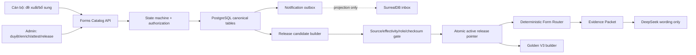

# Implementation Plan: Quản trị thủ tục, biểu mẫu và Golden V3

**Branch**: `017-procedure-form-governance` | **Date**: 2026-08-11 | **Spec**: [spec.md](spec.md)

**Input**: Feature specification from `/specs/017-procedure-form-governance/spec.md`

## Summary

Feature 017 hợp nhất các catalog/review/release JSON hiện có vào một kiến trúc chuyển tiếp có PostgreSQL làm nguồn chuẩn pháp lý, state machine xác định, release manifest nguyên tử và Form Router không giao quyết định biểu mẫu cho LLM. Lát triển khai này tạo schema additive, repository/service/API/UI và bộ kiểm thử trên dữ liệu cô lập; giữ JSON read-only compatibility; không apply live migration, không tự duyệt/phát hành, không browser UAT. Golden V3 builder chỉ đóng băng 1.000 case khi active release đã có coverage decision 100% và người dùng duyệt workbook.

## Technical Context

**Language/Version**: Python 3.11–3.12; TypeScript 5 / React 19 / Next.js 16

**Primary Dependencies**: FastAPI, Pydantic 2, SQLAlchemy/psycopg2 (lazy-loaded legal PostgreSQL runtime), existing Surreal notification repository, Next.js, React Query, Vitest

**Storage**: PostgreSQL legal release database (canonical); SurrealDB notification projection only; immutable files/e-form URLs; current JSON catalogs read-only compatibility

**Testing**: pytest, contract fixtures, isolated PostgreSQL rehearsal, Vitest, Next production build; browser UAT explicitly excluded

**Target Platform**: Windows/Linux local deployment and containerized internet deployment

**Project Type**: FastAPI + Next.js web application with separate legal retrieval PostgreSQL

**Performance Goals**: Form procedure resolution P95 ≤3 seconds; end-to-end Ask P95 ≤25 seconds; deterministic SQL binding lookup normally <300 ms; provider errors <0.5%

**Constraints**: No live migration/backfill/re-index; no automatic legal approval/publication; no LLM-selected form IDs; no hard delete; active release pointer changes only after explicit admin release action

**Scale/Scope**: 191 commune procedures, 131 unique form identities, 229 bindings, five domains; Golden V3 1,000 cases

## Constitution Check

- **Legal grounding — PASS**: Official URL, issuing instrument, effectivity, authority, checksum and release decision are mandatory. Missing/conflicting evidence becomes clarification, verified gap or source gap.
- **Role and data isolation — PASS**: Officer access is ownership + server-authoritative domain scoped; Admin has explicit transitions; Citizen reads only active released projection. Negative ID/domain/role tests are mandatory.
- **Deterministic retrieval and fallback — PASS**: Exact procedure code/name/approved alias first; BM25/vector can only nominate procedures; SQL manifest determines form set. Provider failure cannot change form IDs.
- **Privacy and security — PASS**: Review notes, local paths and audit internals are private. Workflow events store reason codes and hashes, not credentials/PII. Public API redacts admin trace.
- **Verification — PASS WITH EXTERNAL GATES**: Unit/contract/integration/build and isolated rehearsal are in scope. Official-source campaign, live migration/release and browser UAT require separate approval.
- **Performance and operability — PASS**: Separate procedure lookup, SQL binding, generation and end-to-end timings; active pointer and rollback release IDs exposed only in admin trace.
- **Documentation — PASS**: Add `docs/7-DEVELOPMENT/feature017-procedure-form-governance.md` and operations runbook.

### Post-design constitution re-check

PASS. The design uses one canonical repository and an outbox-style notification projection, retains all legal safety gates and introduces no paid/mandatory parser, worker or live corpus mutation.

## Architecture



## Implementation slices

### Slice 1 — Spec, schema and pure domain core

- Add PostgreSQL forward/down SQL with constraints, indexes, append-only event trigger, release manifest and singleton active pointer.
- Add guarded migration rehearsal command that refuses live/default database names and defaults to plan-only.
- Implement Pydantic/domain types, transition matrix, attestation fingerprint and release manifest canonical hashing.
- Verify with pure unit tests before any route integration.

### Slice 2 — Repository, workflow API and role gates

- Add repository protocol, SQLAlchemy PostgreSQL implementation and in-memory test repository.
- Add service layer for submit/supplement/source review/enrichment/attestation/release/rollback/coverage.
- Add `/api/procedures/forms-catalog` router while retaining legacy adapters.
- Write contract and negative authorization/tampering tests first.

### Slice 3 — Admin/Officer UI

- Extend typed API client.
- Add simple candidate queue with three first actions and legal enrichment wizard.
- Add officer proposal/status views and admin coverage/release preview.
- Keep legal attestation/release explicit; no single “approve and publish” action.

### Slice 4 — Form Router and Ask integration

- Add active-release catalog adapter and procedure resolver.
- Exact match before limited lexical candidate ranking; ambiguity is explicit.
- Resolve final form set only from released binding rows and hard gates.
- Populate Evidence Packet and `recommended_forms`; DeepSeek sees read-only evidence and cannot introduce IDs/URLs.
- Retain current JSON router behind compatibility flag until PostgreSQL activation is separately approved.

### Slice 5 — Coverage campaign and Golden V3

- Import baseline as read-only staging proposal/coverage report, never as approved legal state.
- Build deterministic release-derived Golden V3 schema, validator and workbook exporter.
- Enforce 100% coverage + human review before freeze. With current 100 pending identities, generate a review queue/report but do not claim final approved dataset.

### Slice 6 — Final non-browser gate

- Run targeted backend/frontend tests, full relevant suites, lint/build and isolated performance benchmark.
- Update development/operations documentation.
- Stop and request separate approval before live schema apply, official-source campaign decisions, active pointer activation or browser UAT.

## Project Structure

```text
api/
├── form_governance_models.py          # types, transition rules, hashes
├── form_governance_repository.py      # protocol + PostgreSQL implementation
├── form_governance_service.py         # workflow, coverage and release orchestration
├── form_router_v3.py                  # deterministic active-release selection
└── routers/
    └── procedure_forms_catalog.py     # /api/procedures/forms-catalog

scripts/
├── feature017_migrations/
│   ├── 001_procedure_form_governance_up.sql
│   └── 001_procedure_form_governance_down.sql
├── manage_feature017_form_schema.py
├── build_feature017_coverage.py
└── build_feature017_golden_v3.py

frontend/src/
├── lib/api/legal-import.ts
├── components/legal-import/FormGovernancePanel.tsx
└── app/(dashboard)/legal-import/page.tsx

tests/
├── test_feature017_schema_rehearsal.py
├── test_feature017_workflow.py
├── test_feature017_api.py
├── test_feature017_release.py
├── test_feature017_form_router.py
├── test_feature017_coverage.py
└── test_feature017_golden_v3.py

specs/017-procedure-form-governance/
└── contracts/
```

**Structure Decision**: Giữ kiến trúc FastAPI/Next hiện có, tách core governance khỏi router lớn `ward_procedures.py` và tái sử dụng deterministic catalog gates. PostgreSQL repository được lazy-load để local JSON compatibility không crash khi dependency/schema chưa được kích hoạt.

## Data migration and compatibility

1. SQL migration chỉ additive, không đụng `legal_documents/legal_chunks`.
2. Rehearsal bắt buộc database cô lập, explicit confirmation và rollback empty/fixture data.
3. Existing JSON data được đọc để tạo staging import proposal/coverage, không tự chuyển thành attested/released PostgreSQL rows.
4. `FORM_GOVERNANCE_SOURCE=json_compat|postgres_shadow|postgres_active`; mặc định hiện tại là `json_compat`.
5. `postgres_shadow` so sánh quyết định nhưng public answer vẫn dùng JSON active catalog.
6. `postgres_active` và active release cần approval riêng sau gates.

## Risk controls

| Risk | Control |
|------|---------|
| Duyệt nguồn bị hiểu là phát hành | Runtime eligibility chỉ từ active release binding; transition riêng |
| LLM bịa/chọn mẫu | Provider không nhận quyền ghi IDs/URLs; output form set dựng ngoài LLM |
| Dual-write PostgreSQL/Surreal | PostgreSQL transaction canonical; Surreal notification là projection có retry/status |
| JSON và PostgreSQL lệch | Shadow comparison manifest + source fingerprint; explicit activation flag |
| Release nửa chừng | Immutable manifest + transactional active pointer + rollback pointer |
| Officer sửa domain/ID | Server derives assignment and ownership; negative API tests |
| 100 identity thiếu bị tự “hoàn thành” | Coverage remains unresolved until human `released` or evidenced `verified_gap` |
| Golden model-generated truth | Ground truth loaded from active manifest only; paraphrases remain proposed |

## Complexity Tracking

Không có vi phạm constitution cần miễn trừ. Repository/state-machine là cần thiết để thực thi single source of truth và transaction boundaries; không tạo thêm service hoặc background daemon.

