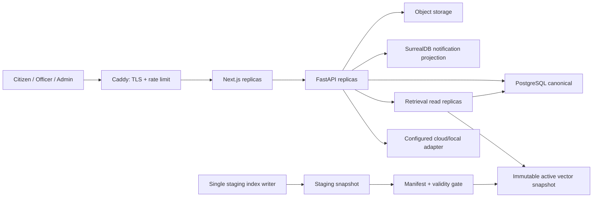

# Implementation Plan: Hoàn thiện sản phẩm để phát hành Internet

**Branch**: `codex/006-public-production-readiness` (existing dirty worktree; no branch switch) | **Date**: 2026-08-13 | **Spec**: [spec.md](spec.md)

**Input**: Feature specification from `/specs/018-production-release-readiness/spec.md`

## Summary

Feature 018 đưa các phần đã phát triển rời rạc về một sản phẩm có thể phát hành: sổ đăng ký chức năng và route; pipeline hỏi đáp/câu trả lời thống nhất; chat và hỗ trợ trực tuyến chịu tải; vòng đời văn bản cùng impact/index manifest; workflow thủ tục/biểu mẫu/FAQ dễ dùng; dashboard/audit no-tech; bảo mật, backup/restore, observability và Go/No-Go có bằng chứng. PostgreSQL là nguồn chuẩn nghiệp vụ/pháp lý, Chroma phục vụ immutable active snapshot, SurrealDB chỉ giữ projection thông báo. Triển khai theo lát nhỏ, additive và feature flag; không apply migration sống, re-index vector thật hoặc kích hoạt production trước lát được phê duyệt và đủ gate.

## Technical Context

**Language/Version**: Python 3.11–3.12; TypeScript 5; React 19; Next.js 16

**Primary Dependencies**: FastAPI, Pydantic 2, SQLAlchemy/psycopg2 runtime, httpx, Chroma client, SurrealDB client, Next.js, React Query, Zustand, Vitest, Playwright

**Storage**: PostgreSQL canonical; Chroma immutable active/staging snapshots; S3-compatible object storage for production files; SurrealDB notification projection; append-only hash-chained audit

**Testing**: pytest, Vitest, Playwright, JSON-schema/contract tests, isolated PostgreSQL rehearsal, k6/Locust-compatible load harness, backup/restore rehearsal, frontend build/lint/type-check

**Target Platform**: Linux containerized Internet deployment and supported Windows/Linux local deployment

**Project Type**: FastAPI + Next.js web application with a separate retrieval process/service and background maintenance jobs

**Performance Goals**: Retrieval P95 ≤3s; full answer P95 ≤25s; support create/send P95 ≤1s; queue status P95 ≤500ms; provider/timeout errors <0.5%

**Constraints**: Preserve validity, authority, role, procedure, form, citation and checksum gates; no fabricated legal facts; no destructive corpus rewrite; no paid/new daemon without approval; BGE off until activation gate; no raw legal token streaming before validation

**Scale/Scope**: 1,000 logged-in/waiting users, 100 concurrent asks, 30 officers, max 3 active sessions/officer, 90 realtime support sessions; five commune-level Hai Phong domains; designed to scale to 5,000 users by replicas

## Constitution Check

- **Legal grounding — PASS**: Official/verified sources, authority, jurisdiction, effectivity and `legal_as_of` remain hard gates. Exact Article preserves full structure; insufficient evidence keeps verified claims and explains gaps.
- **Role and data isolation — PASS**: Citizen ownership, officer domain/assignment and admin reason-based sensitive access are server enforced; direct API and identifier-tampering tests are mandatory.
- **Deterministic retrieval and fallback — PASS**: Router, exact identities, BM25/vector/RRF, legal hard gates and released form SQL execute before the LLM. Optional BGE, OCR, provider and notification projection fail explicitly without changing legal truth.
- **Privacy and security — PASS**: Support content, attachments, credentials and sessions are sensitive. Upload validation, token hashing, revocation, audit and content-free telemetry are required.
- **Verification — PASS WITH APPROVAL GATES**: Isolated schema/contracts/tests are approved. Live migration, vector mutation, public pointer activation and production rollout remain gated by backup/rehearsal, user approval and Go/No-Go.
- **Performance and operability — PASS**: Retrieval, generation and total timings are separate; support load, connection pools, active vector fingerprints, backup age and restore evidence are measured.
- **Documentation — PASS**: Architectural decisions and runbooks are recorded under `docs/7-DEVELOPMENT/`.

### Post-design constitution re-check

PASS. The design keeps one legal source of truth, makes release/pointer changes atomic and reversible, preserves role/legal gates, and introduces no mandatory paid service or unapproved background daemon.

## Architecture



### Answer path

```text
Intent/domain router
→ exact article/procedure OR BM25 + vector
→ RRF and deterministic hard gates
→ optional BGE top 40 when activated
→ per-issue Evidence Packet
→ one generation
→ claim/citation validator
→ LegalAnswerCard
→ audit
```

### Support path

```text
Domain confirmation → queued ticket → polling position
→ transaction-safe allocator → max three active/officer
→ realtime only after assignment → close/rating/retention
```

## Implementation Slices

### Slice 1 — Feature foundation and Capability Registry

- Create Feature 018 artefacts and a machine-readable registry for frontend pages, API routers and jobs.
- Add a verifier that reports owner/role/source/audit/test/rollback gaps without changing runtime.
- Classify legacy routes and add tests for disabled/redirected routes.

### Slice 2 — Unified answer presentation and chat UX

- Introduce backward-compatible `LegalAnswerPresentationV1` projection from existing Ask fields.
- Render one answer card for structured/legacy output; keep forms/citations backend-owned.
- Make message viewport independently scrollable, composer/new-chat persistent and history paginated.

### Slice 3 — PostgreSQL support foundation and allocator

- Add additive support tables and an idempotent JSON import/shadow comparison rehearsal.
- Add ticket/presence/assignment state machines, `SKIP LOCKED` allocator and one queue stream/officer.
- Move waiting users to backoff polling; open realtime only after assignment.
- Add citizen My Requests, officer queue and admin metadata/SLA views.

### Slice 4 — Legal lifecycle, impact and vector serving state

- Extend lifecycle projections for future/expiring/partial/replaced/suspended/corrected/consolidated/unknown statuses.
- Record change events, provision effectivity, document relationships and reviewable impact cases.
- Create read-only vector manifest/reconciliation and incremental index job contracts; no live re-index in this slice.

### Slice 5 — Procedure, form and FAQ workflow convergence

- Reuse Feature 017 active release and state machine; replace ambiguous buttons with explicit step actions.
- Add searchable procedure picker and URL/file/e-form proposal without manual form IDs.
- Add PostgreSQL FAQ revision/release model and derive forms from confirmed procedure active release.
- Preserve JSON read-only compatibility through one release.

### Slice 6 — No-tech dashboard, activity center and model setup

- Reorganize admin information into actions, service health and collapsed technical detail.
- Add lifecycle/support/vector/import/form/FAQ/provider alert cards linked to filtered lists.
- Add role/module/result/time activity filters and reason-gated sensitive detail/export.
- Unify cloud and local model setup in a guided wizard with capability checks.

### Slice 7 — Security, retention and operability

- Complete server-side ACL, rate limit, session revoke/version, admin MFA and upload security.
- Add hash-chain audit checkpoints and retention jobs.
- Split frontend/API deployment, add shared observability contracts, backup/restore scripts and runbooks.

### Slice 8 — Quality gates and controlled rollout

- Complete T086 1,000 live DeepSeek full-answer evaluation and SLA evidence.
- Complete T091 browser UAT 20 citizen + 20 officer and full admin journeys.
- Run 100/294/Golden V3 1,000, load 1,000 users/30 officers, security and restore gates.
- Canary citizen 10% → 50% → 100%, then officer/admin, with 72-hour observation before stable.

### Slice 9 — Retrieval Quality V2 remediation

- Version Recall@10/MRR@10 denominators so answer-required and expected-refusal cases are measured separately.
- Correct date-scoped effectivity routing and replay each benchmark case at its approved `legal_as_of`.
- Produce checksum-bound source-gap and stage-diagnostic artifacts for Golden-1.000 and the new Hard-negative-500 suite, while retaining Hard-negative-100 as legacy remediation evidence.
- Build Stage E as 1,500 visible development cases plus a 500-case independently held production holdout. The repository stores only the holdout envelope and aggregate acceptance receipt; it must never store holdout questions, expected sources, issue labels or per-case misses.
- Bind every development case to a canonical checksum and reject normalized duplicates. Bind the holdout envelope to source snapshot, approved manifest, quota attestation and cross-split leakage-audit checksums. A holdout run consumes its version whether it passes or fails.
- Require candidate Recall@50 before reranking; keep candidate-vNext, learned reranker and active-pointer changes behind separate legal/data and activation gates.

### Slice 10 — Vector Integrity V3 and clean re-embedding

- Introduce an additive, immutable chunk-release store so a canonical splitter can rebuild retrieval chunks without rewriting `legal_article_chunks` V1.
- Replace the ambiguous embedding fingerprint with separate model-artifact, embedding-recipe, passage-recipe, splitter, source-snapshot and persisted-vector fingerprints in `legal-serving-manifest-v3`.
- Assess every document in the complete 12,236-document source inventory fail-closed: keep current and historical serving separate, serve only reviewed/eligible chunks, and keep unresolved documents explicitly quarantined rather than guessing legal metadata.
- Build a new staging collection only from V2 eligible chunks and freshly generated VNLegal-LAL vectors; copying legacy vectors, mutating the M2 collection and switching the active pointer remain prohibited until independent acceptance and approval.
- Keep manifest V2 readable for pointer rollback while new imports target staging releases instead of directly upserting the active collection.

## Project Structure

```text
api/
├── capability_registry.py
├── legal_answer_presentation.py
├── support_*.py
├── legal_lifecycle_*.py
├── legal_impact_*.py
├── vector_manifest.py
├── faq_governance_*.py
└── routers/
    ├── live_support.py
    ├── legal_search.py
    ├── procedure_forms_catalog.py
    └── admin_*.py

frontend/src/
├── app/(dashboard)/
│   ├── admin/
│   ├── search/
│   ├── live-support/
│   ├── legal-management/
│   ├── legal-import/
│   └── faq-management/
├── components/search/
├── components/legal/
├── components/support/
└── lib/api/

scripts/
├── feature018_migrations/
├── audit_capability_registry.py
├── rehearse_feature018_postgres.py
├── build_vector_serving_manifest.py
├── load_test_support.py
└── verify_production_readiness.py

deploy/
├── caddy/
├── monitoring/
└── runbooks/

tests/
├── test_capability_registry.py
├── test_legal_answer_presentation.py
├── test_support_*.py
├── test_legal_lifecycle_*.py
├── test_vector_manifest.py
├── test_faq_governance.py
└── test_production_readiness.py
```

**Structure Decision**: Giữ monorepo FastAPI/Next.js và retrieval service hiện có để tránh viết lại nghiệp vụ. Các core mới tách khỏi router lớn, schema additive và adapters giữ tương thích. Deployment tách frontend/API ở cấu hình production nhưng local-first vẫn có launcher đơn giản.

## Migration and Compatibility

1. Backup và fingerprint nguồn hiện tại.
2. Rehearse schema trên database cô lập; runner từ chối tên database live/default nếu thiếu cờ xác nhận.
3. Additive tables/indexes only; không rewrite `legal_documents`/`legal_chunks`.
4. Import JSON support/FAQ idempotent vào staging/shadow và so sánh count, ownership, timestamps, attachments, state.
5. Dừng write JSON trong cửa sổ chuyển đổi đã phê duyệt; switch pointer sang PostgreSQL bằng một transaction.
6. Giữ JSON read-only trong một release và rollback pointer nếu reconciliation fail.
7. Vector writer chỉ tạo staging snapshot; activation là pointer switch sau manifest gate.

## Deployment Topology

- Gateway: 2 vCPU, 2–4 GB RAM.
- Frontend: tối thiểu 2 replica, mỗi replica 2 vCPU/4 GB.
- API: tối thiểu 2 replica, mỗi replica 4 vCPU/8 GB.
- Retrieval: 2 read replica, mỗi replica 8 vCPU/16–32 GB RAM/NVMe.
- PostgreSQL: 8 vCPU/32 GB RAM/NVMe/WAL backup.
- SurrealDB projection: 4 vCPU/8 GB.
- Object storage: tối thiểu 200 GB, versioning/lifecycle.
- Optional inference GPU: node riêng ≥16 GB VRAM; cloud-first không bắt buộc GPU.

Các con số là cấu hình khởi điểm và phải điều chỉnh bằng load test; connection budget không vượt 70% `max_connections`.

## Release and Rollback

- Staging → canary citizen 10/50/100 → officer → admin.
- Image, data release, form/FAQ release và vector pointer đều versioned.
- Rollback ưu tiên image/pointer/feature flag; migration additive không drop dữ liệu khi sự cố.
- Không rollback bằng cách tắt validity, authority, role, procedure, citation, checksum hoặc audit gate.
- `production-ready` chỉ khi không còn P0/P1 và mọi gate trong quickstart/release evidence đạt.

## Complexity Tracking

Không có miễn trừ Constitution. Capability Registry, state machine, manifest và release pointer là các cấu trúc tối thiểu để kiểm soát phạm vi lớn, tránh dual truth và chứng minh rollback; không tạo microservice mới ngoài các process đã có.
